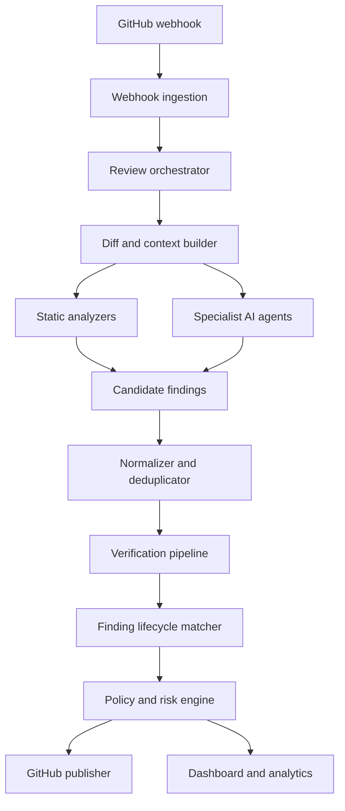
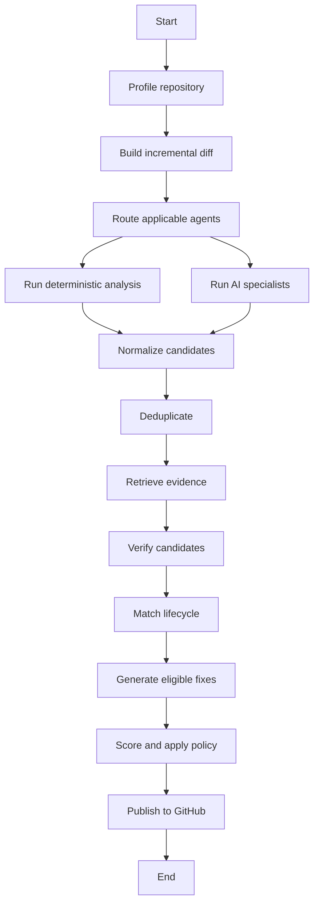

# Codezy Level 2 — Complete Implementation Plan

> **Product promise:** Codezy doesn’t merely find possible problems—it verifies them, tracks them across commits, and gives developers a safe, actionable fix.

---

## 1. Document Purpose

This document defines the complete implementation plan for evolving Codezy from a multi-agent pull-request reviewer into a trustworthy, context-aware review platform.

Level 2 must improve four areas:

1. **Accuracy** — reduce false positives through evidence collection and independent verification.
2. **Continuity** — track findings across multiple commits instead of reviewing every update as an unrelated PR.
3. **Actionability** — give developers precise explanations and safe, applicable fixes.
4. **Control** — let repositories define what should block, warn, or be ignored.

This is an incremental upgrade. The existing GitHub App, webhook, BullMQ, PostgreSQL, Prisma, Socket.io, Next.js, and multi-agent foundation should remain in place.

---

## 2. Current Level 1 Baseline

The current system already supports:

- GitHub App installation and OAuth authentication.
- Verified GitHub webhook processing.
- Fast webhook acknowledgement.
- BullMQ background review jobs.
- Parallel agents for security, style, logic, performance, testing, and Git hygiene.
- A Judge Agent that aggregates findings.
- Path-weighted severity scoring.
- GitHub PR summary comments and Check Runs.
- Real-time agent progress through Socket.io.
- Repository configuration through `.codezy.yaml`.
- Model selection based on diff size.

Level 2 will retain these capabilities while replacing the current “agents produce findings → judge creates score” flow with an evidence-driven review lifecycle.

---

## 3. Level 2 Goals and Non-Goals

### 3.1 Goals

- Review the current PR diff with relevant repository context.
- Produce findings with file, line, evidence, confidence, and impact.
- Independently verify potentially important AI findings.
- Deduplicate overlapping findings across agents.
- Track each finding across new commits.
- Distinguish new, existing, resolved, reopened, dismissed, and outdated findings.
- Separate risk score from merge decision.
- Allow repository-specific blocking policies.
- Post important findings as inline GitHub comments.
- Generate safe GitHub suggestion blocks for localized changes.
- Collect developer feedback on findings.
- Reuse prior review results during incremental reviews.
- Provide transparent cost, latency, confidence, and quality metrics.

### 3.2 Non-Goals for Level 2

- Automatically pushing commits to a developer branch.
- Automatically merging or closing pull requests.
- Executing untrusted repository code directly on the main Codezy server.
- Fine-tuning models from individual developer feedback.
- Full-repository indexing on every pull request.
- Replacing established deterministic scanners with an LLM.
- Supporting every programming language equally in the first release.
- Becoming a complete CI/CD platform.

These capabilities can be evaluated for later levels after Level 2 is stable.

---

## 4. Level 2 Success Criteria

The release is successful when:

- At least 80% of blocking findings include directly inspectable evidence.
- Every blocking AI finding passes the verification stage.
- Findings persist correctly across PR synchronize events.
- A resolved finding is not reposted as a new finding.
- Duplicate inline comments are not created on every push.
- Low-confidence findings never block a PR.
- Style-only findings cannot fail a PR unless the repository explicitly enables that policy.
- A suggested patch is shown only when it can be anchored to the current diff.
- Webhook delivery retries do not create duplicate review jobs.
- Every merge decision can be explained using stored policy evaluation results.
- The dashboard can show new, remaining, resolved, dismissed, and blocking findings.
- Review cost and duration are recorded per agent and per pull request.

---

## 5. Target Architecture



### 5.1 Core services

| Service | Responsibility |
|---|---|
| Webhook Ingestion | Verify signature, enforce idempotency, persist the delivery, and enqueue work. |
| Review Orchestrator | Create review attempts and coordinate all review stages. |
| Diff Service | Fetch changed files, patches, commits, and diff metadata. |
| Repository Profiler | Detect languages, frameworks, test tools, package manager, and important paths. |
| Context Retriever | Fetch only the symbols and files required to evaluate changed code. |
| Static Analysis Runner | Execute deterministic scanners and convert results into the common finding format. |
| Agent Runtime | Run specialist AI agents using structured inputs and outputs. |
| Finding Normalizer | Validate schema, normalize locations, and reject malformed findings. |
| Deduplication Engine | Merge semantically equivalent findings from multiple sources. |
| Verification Engine | Confirm evidence, relevance, confidence, and introduced-by-PR status. |
| Lifecycle Matcher | Match findings with previous review findings using stable identities. |
| Risk Engine | Calculate risk and confidence metrics. |
| Policy Engine | Produce PASS, WARNING, or ACTION_REQUIRED. |
| Patch Generator | Produce constrained GitHub suggestions for eligible findings. |
| GitHub Publisher | Maintain one summary comment, inline comments, and Check Runs. |
| Feedback Service | Record helpful, false-positive, dismissed, and accepted-risk actions. |
| Telemetry Service | Track progress, failures, token usage, cost, and latency. |

---

## 6. Revised Review Lifecycle

### 6.1 Webhook events

Level 2 should initially process:

- `pull_request.opened`
- `pull_request.reopened`
- `pull_request.synchronize`
- `pull_request.ready_for_review`
- `pull_request.closed`
- `installation.created`
- `installation.deleted`
- `installation_repositories.added`
- `installation_repositories.removed`

Draft PR behavior should be configurable:

- `skip` — do not review drafts.
- `summary_only` — review but do not create blocking checks.
- `full` — run the normal review.

### 6.2 End-to-end sequence

1. Receive the GitHub webhook.
2. Verify the HMAC signature using the exact raw request body.
3. Read `X-GitHub-Delivery` and create an idempotency record.
4. If the delivery already exists, return `200` without enqueueing another job.
5. Confirm that the event and action are supported.
6. Upsert the installation and repository reference.
7. Upsert the pull-request identity.
8. Create a new immutable `ReviewAttempt` for the current `headSha`.
9. Return `200` immediately.
10. Add one orchestrator job using a deterministic job ID.
11. Fetch the PR metadata, changed files, commits, and patches.
12. Load and validate `.codezy.yaml`.
13. Build or refresh the repository profile.
14. Compare the new `headSha` with the previous reviewed SHA.
15. Determine which files, hunks, findings, and agents require re-evaluation.
16. Run deterministic scanners.
17. Run relevant specialist AI agents.
18. Normalize and deduplicate candidate findings.
19. Retrieve additional context for important or uncertain candidates.
20. Verify the candidates.
21. Match verified findings against previous findings.
22. Mark prior findings as open, resolved, reopened, dismissed, or outdated.
23. Generate fixes only for eligible findings.
24. Calculate risk and review-confidence metrics.
25. Evaluate repository policies.
26. Update the GitHub Check Run.
27. Update the single persistent PR summary comment.
28. Create or update inline comments without duplicating existing comments.
29. Emit final dashboard events.
30. Store cost, token, duration, failure, and quality metrics.

---

## 7. LangGraph Review Workflow

The graph should use explicit state and independently retryable stages.



### 7.1 Graph state

```ts
interface ReviewGraphState {
  reviewAttemptId: string;
  repositoryId: string;
  pullRequestId: string;
  installationId: string;

  baseSha: string;
  headSha: string;
  previousReviewedSha?: string;

  repositoryProfile: RepositoryProfile;
  repositoryPolicy: RepositoryPolicy;
  changedFiles: ChangedFile[];
  incrementalFiles: ChangedFile[];

  selectedAgents: AgentType[];
  candidateFindings: CandidateFinding[];
  normalizedFindings: NormalizedFinding[];
  verifiedFindings: VerifiedFinding[];
  lifecycleResults: FindingLifecycleResult[];

  riskResult?: RiskResult;
  policyDecision?: PolicyDecision;
  usage: ReviewUsage;
  warnings: PipelineWarning[];
}
```

### 7.2 Node responsibilities

#### `profileRepository`

- Detect language distribution.
- Read manifest files.
- Detect frameworks, ORM, test runner, lint configuration, and package manager.
- Locate generated-code directories.
- Identify sensitive domains such as authentication, payment, infrastructure, and migrations.
- Cache the profile using repository and default-branch SHA.

#### `buildIncrementalDiff`

- Fetch the current PR changed files.
- Compare the current `headSha` with `previousReviewedSha`.
- Identify new and modified hunks.
- Identify deleted or renamed files.
- Determine which previous finding locations were touched.

#### `routeAgents`

- Select agents based on file type, path, change type, and repository configuration.
- Do not run irrelevant agents.
- Record why each agent was selected or skipped.

#### `runDeterministicAnalysis`

- Secret detection.
- Dependency audit.
- Linter output where safely available.
- Migration rules.
- Git hygiene.
- AST-based rules supported by the target language.

#### `runSpecialistAgents`

- Run applicable agents in parallel with concurrency limits.
- Require structured JSON output.
- Store raw output separately from accepted findings.
- Retry transient failures without rerunning completed agents.

#### `normalizeCandidates`

- Validate output with Zod.
- Normalize severity values.
- Validate line ranges against the current patch.
- Remove findings without a valid location or evidence.
- Convert deterministic and AI findings into one shared schema.

#### `deduplicateFindings`

- Group candidates by file, line range, rule, and semantic similarity.
- Prefer deterministic evidence over AI-only evidence.
- Merge explanations without merging unrelated root causes.

#### `retrieveEvidence`

- Fetch imported symbols, called functions, related types, schema definitions, and relevant tests.
- Limit depth and token budget.
- Never fetch arbitrary repository-wide content without a reason.

#### `verifyCandidates`

- Verify important candidates independently.
- Reject unsupported findings.
- Assign verification status and calibrated confidence.
- Determine whether the issue was introduced by the PR.

#### `matchFindingLifecycle`

- Match current findings to findings from earlier attempts.
- Preserve stable finding identity.
- Update lifecycle status without deleting history.

#### `generateEligibleFixes`

- Generate fixes only for verified, localized, high-confidence findings.
- Validate that the target lines still match the current head SHA.
- Store the patch separately from the finding.

#### `scoreAndApplyPolicy`

- Calculate PR-level risk.
- Calculate coverage and confidence.
- Apply blocking rules.
- Produce an explainable policy decision.

#### `publishToGitHub`

- Update the existing Check Run.
- Update the existing summary comment.
- Add, update, minimize, or resolve inline comments.
- Never create duplicate comments for the same finding and SHA.

---

## 8. Agent Design

### 8.1 Agent categories

#### Existing agents to retain

- Security
- Logic and correctness
- Performance
- Testing
- Style and conventions
- Git hygiene

#### New Level 2 agents

| Agent | Primary responsibility |
|---|---|
| API Contract | Detect request/response, status-code, schema, and backward-compatibility issues. |
| Database and Migration | Detect destructive migrations, missing indexes, unsafe nullability, transaction gaps, and query risks. |
| Dependency Risk | Explain vulnerabilities, risky upgrades, duplicate packages, and suspicious lifecycle scripts. |
| Architecture | Detect repository-specific boundary and dependency violations. |
| Concurrency | Detect race conditions, missing idempotency, retry side effects, and unsafe shared state. |
| Observability | Detect missing error context, secret leakage in logs, and absent critical metrics. |
| Verification | Independently validate findings produced by other agents. |

### 8.2 Applicability rules

Agents must not run on every PR.

| Change | Applicable agents |
|---|---|
| Documentation only | Git hygiene and optional documentation checks |
| Package manifest or lock file | Dependency risk, security |
| Prisma schema or migration | Database, security, testing |
| API route/controller | Security, logic, API contract, testing, observability |
| React component | Logic, performance, accessibility/style if enabled, testing |
| Queue or worker | Logic, concurrency, observability, testing |
| Authentication code | Security, logic, testing, API contract |
| Configuration or infrastructure | Security, logic, dependency risk |

### 8.3 Agent input contract

Each AI agent receives:

- Review objective.
- Current file patch.
- Minimal surrounding code.
- Relevant imported symbols.
- Repository profile.
- Repository rules for that category.
- Existing findings related to touched lines.
- Exact JSON output schema.
- A prohibition on reporting unrelated pre-existing issues as newly introduced.

### 8.4 Agent output contract

```ts
interface CandidateFinding {
  source: "AI" | "STATIC" | "DEPENDENCY_SCANNER";
  sourceAgent: AgentType;
  ruleId?: string;

  category: FindingCategory;
  title: string;
  description: string;

  filePath: string;
  startLine: number;
  endLine: number;
  side: "RIGHT" | "LEFT";

  severity: FindingSeverity;
  confidence: number;

  evidence: {
    changedCode: string;
    relatedContext?: string;
    reasoning: string;
  };

  impact: string;
  recommendation?: string;
}
```

### 8.5 Prompt principles

- Analyze only supplied evidence.
- State uncertainty explicitly.
- Do not invent unavailable files or symbols.
- Do not report formatting preferences as correctness bugs.
- Do not classify a finding as critical without an exploitable or catastrophic impact.
- Cite the exact changed lines.
- Explain the runtime scenario required for the issue to occur.
- Prefer one precise finding over several variations of the same finding.
- Return an empty findings array when no supported issue exists.

---

## 9. Repository Context Engine

### 9.1 Repository profile

```ts
interface RepositoryProfile {
  languages: Array<{
    name: string;
    percentage: number;
  }>;

  frameworks: string[];
  packageManager?: string;
  testFrameworks: string[];
  orm?: string;

  sourceRoots: string[];
  testRoots: string[];
  generatedPaths: string[];
  sensitivePaths: SensitivePathRule[];

  manifests: ManifestSummary[];
  architecturalPatterns: ArchitecturePattern[];

  defaultBranchSha: string;
  generatedAt: Date;
}
```

### 9.2 Context retrieval strategy

For each changed hunk:

1. Parse changed symbols where language tooling is supported.
2. Resolve direct imports.
3. Retrieve definitions of referenced types and functions.
4. Retrieve matching tests.
5. Retrieve schema or validation definitions when relevant.
6. Retrieve repository rules.
7. Rank context by relevance.
8. Stop when the agent-specific token budget is reached.

### 9.3 Context limits

- Maximum context depth: two dependency hops.
- Maximum referenced files per finding: configurable, initially five.
- Maximum context characters per agent invocation: model-tier dependent.
- Generated files should be excluded by default.
- Binary files should never be sent to an LLM.
- Secrets found during ingestion must be redacted before LLM processing.

### 9.4 Caching

Cache:

- Repository profile by default-branch SHA.
- File content by blob SHA.
- Parsed symbols by blob SHA.
- Manifest summaries by blob SHA.
- `.codezy.yaml` by blob SHA.

Do not cache installation tokens or unredacted secrets.

---

## 10. Finding Verification

### 10.1 Why verification is required

An AI specialist produces a hypothesis, not a confirmed defect. Verification converts candidate findings into review findings that can safely influence merge decisions.

### 10.2 Verification statuses

```ts
enum VerificationStatus {
  VERIFIED
  LIKELY
  UNVERIFIED
  REJECTED
}
```

### 10.3 Verification questions

The verifier must determine:

1. Does the cited code exist at the stated location?
2. Is the finding related to changed code?
3. Is the claimed runtime path realistic?
4. Is the issue already prevented elsewhere?
5. Does repository context support the claim?
6. Is the severity justified?
7. Is the impact described accurately?
8. Is the recommendation compatible with the codebase?

### 10.4 Verification routes

Use the strongest available verification route:

1. **Deterministic proof** — static scanner, parser, dependency database, compiler, or test output.
2. **Cross-context proof** — related code confirms that a guard, type, transaction, or test is missing.
3. **Independent model verification** — a separate verification prompt evaluates the candidate and evidence.
4. **Unverified** — evidence is insufficient.

### 10.5 Blocking eligibility

A finding can block only if:

- Its verification status is `VERIFIED`, or repository policy explicitly allows `LIKELY`.
- Its confidence is above the configured threshold.
- It is introduced or materially worsened by the PR.
- Its category and severity are configured as blocking.
- It is not dismissed or accepted as risk.

---

## 11. Deduplication Logic

### 11.1 Within one review

Candidate findings should be compared using:

- Repository
- File path
- Overlapping line ranges
- Rule ID
- Category
- Normalized title
- Normalized affected code
- Semantic similarity

### 11.2 Merge rules

- Same rule and same line range: merge automatically.
- Different rules but identical root cause: merge and preserve contributing sources.
- Same location but different root causes: keep separately.
- Deterministic and AI versions of the same issue: keep deterministic evidence as primary.
- Security and style findings on the same line: do not merge unless they describe the same root cause.

### 11.3 Finding fingerprint

```text
fingerprint = SHA-256(
  repositoryId
  + normalizedFilePath
  + category
  + stableRuleOrRootCause
  + normalizedCodeAnchor
)
```

Line numbers must not be the main identity because they change when code moves.

### 11.4 Code anchor

Build a code anchor from:

- The nearest symbol name.
- A normalized affected expression or statement.
- Limited surrounding structural tokens.
- The rule or root-cause identifier.

This allows the same finding to survive line movement across commits.

---

## 12. Finding Lifecycle Across Commits

### 12.1 Lifecycle statuses

```ts
enum FindingStatus {
  NEW
  OPEN
  RESOLVED
  REOPENED
  DISMISSED
  ACCEPTED_RISK
  OUTDATED
}
```

### 12.2 Matching logic

When a new review attempt completes:

1. Exact fingerprint match → `OPEN`.
2. Strong code-anchor match with moved lines → `OPEN`, update location.
3. Previously resolved fingerprint reappears → `REOPENED`.
4. Previous finding’s affected code was changed and issue is absent → `RESOLVED`.
5. File was deleted → `RESOLVED` with reason `FILE_DELETED`.
6. Finding cannot be evaluated because context disappeared → `OUTDATED`.
7. No previous match → `NEW`.
8. Manually dismissed or accepted-risk findings retain their status unless their root cause materially changes.

### 12.3 History requirements

Never overwrite historical review evidence. Store:

- First detected review attempt.
- Last seen review attempt.
- Resolution review attempt.
- Previous and current locations.
- Severity changes.
- Verification changes.
- Developer actions.
- GitHub comment identifiers.

### 12.4 Review delta

Every re-review must calculate:

```ts
interface ReviewDelta {
  newFindingIds: string[];
  remainingFindingIds: string[];
  resolvedFindingIds: string[];
  reopenedFindingIds: string[];
  outdatedFindingIds: string[];
}
```

---

## 13. Improved Risk Scoring

### 13.1 Finding risk

Each accepted finding gets a raw risk:

\[
R_i = B_i \times C_i \times P_i \times I_i \times E_i \times V_i
\]

Where:

- \(B_i\) = base severity weight.
- \(C_i\) = confidence factor.
- \(P_i\) = path-risk multiplier.
- \(I_i\) = introduced-by-PR factor.
- \(E_i\) = exposure factor.
- \(V_i\) = verification factor.

### 13.2 Suggested factors

#### Base severity

| Severity | Weight |
|---|---:|
| Critical | 10 |
| High | 6 |
| Medium | 3 |
| Low | 1 |

#### Verification

| Status | Factor |
|---|---:|
| Verified | 1.00 |
| Likely | 0.75 |
| Unverified | 0.35 |
| Rejected | 0.00 |

#### Introduction

| Relationship to PR | Factor |
|---|---:|
| Introduced by PR | 1.00 |
| Materially worsened by PR | 0.90 |
| Adjacent or uncertain | 0.50 |
| Pre-existing | 0.20 |

#### Exposure

| Exposure | Factor |
|---|---:|
| Public or internet-facing | 1.40 |
| Privileged internal path | 1.20 |
| Standard application path | 1.00 |
| Development tooling | 0.60 |
| Tests or examples | 0.40 |

### 13.3 PR risk aggregation

Do not add all risks directly. Use diminishing returns so many minor findings do not automatically produce a maximum score.

\[
PRRisk = 10 \times \left(1 - e^{-\frac{\sum R_i}{K}}\right)
\]

Start with \(K = 15\), then calibrate using real review data.

Store a decimal score with two-digit precision.

### 13.4 Separate review metrics

```ts
interface RiskResult {
  riskScore: number;          // 0–10
  qualityScore: number;       // 0–100
  reviewConfidence: number;   // 0–100
  reviewCoverage: number;     // 0–100
  blockingCount: number;
  warningCount: number;
  suggestionCount: number;
}
```

Do not present `qualityScore` as an objective measure of the entire repository. It represents the reviewed PR scope only.

### 13.5 Review confidence

Review confidence should consider:

- Percentage of changed files successfully analyzed.
- Percentage of applicable agents completed.
- Patch availability.
- Context retrieval completeness.
- Verification coverage.
- Static-tool execution success.
- Unsupported language or file types.

If confidence or coverage is low, Codezy should say that the review is incomplete instead of presenting a confident pass.

---

## 14. Policy-Based Merge Decisions

### 14.1 Decision values

```ts
enum MergeDecision {
  PASS
  WARNING
  ACTION_REQUIRED
  INCOMPLETE
}
```

### 14.2 Default policy

| Condition | Decision |
|---|---|
| Verified critical introduced issue | Action required |
| Verified high security or authorization issue | Action required |
| Configured number of verified high issues | Action required |
| Review coverage below minimum | Incomplete |
| Only medium issues | Warning |
| Only low or style findings | Pass with suggestions |
| All candidates rejected | Pass |
| Required agent failed | Incomplete |

### 14.3 Policy evaluation record

Every decision should store:

```ts
interface PolicyDecision {
  decision: MergeDecision;
  policyVersion: string;
  matchedRules: Array<{
    ruleId: string;
    result: boolean;
    findingIds: string[];
    explanation: string;
  }>;
}
```

This is essential for auditability.

---

## 15. `.codezy.yaml` Version 2

```yaml
version: 2

review:
  drafts: summary_only
  incremental: true
  max_inline_comments: 8
  minimum_coverage: 80
  include:
    - "src/**"
    - "prisma/**"
  exclude:
    - "generated/**"
    - "dist/**"
    - "**/*.snap"

agents:
  security: true
  logic: true
  performance: true
  testing: true
  style: false
  api_contract: true
  database: true
  dependency_risk: true
  architecture: false
  concurrency: true
  observability: true

paths:
  - pattern: "src/auth/**"
    risk: 1.5
    tags: ["authentication", "public"]
  - pattern: "src/payments/**"
    risk: 1.5
    tags: ["payments", "public"]
  - pattern: "tests/**"
    risk: 0.4
    tags: ["test"]

policy:
  block:
    verified_critical: true
    verified_high_security: true
    high_findings_at_least: 2
    minimum_confidence: 0.80
  warn:
    medium_findings_at_least: 1
  never_block:
    categories:
      - style

fixes:
  suggestions: true
  minimum_confidence: 0.90
  allowed_severities:
    - critical
    - high
    - medium
```

### 15.1 Configuration handling

- Validate with a versioned Zod schema.
- Reject unknown unsafe values.
- Use secure defaults when the file is absent.
- Display configuration warnings in the dashboard.
- Store the resolved configuration snapshot on every review attempt.
- Never let repository configuration disable platform-level secret protection.

---

## 16. Safe Fix Generation

### 16.1 Fix eligibility

A fix can be generated only when:

- The finding is `VERIFIED`.
- Confidence meets the configured threshold.
- The affected code is part of the current diff.
- The change is localized.
- The correct replacement can be represented as a GitHub suggestion.
- The current file content matches the stored code anchor.
- The fix does not require credentials, business decisions, or architectural assumptions.

### 16.2 Fix statuses

```ts
enum FixStatus {
  NOT_ELIGIBLE
  GENERATED
  VALIDATED
  STALE
  REJECTED
  APPLIED_BY_DEVELOPER
}
```

### 16.3 Validation pipeline

1. Generate the minimal replacement.
2. Confirm that the target range is still present.
3. Parse the resulting file when a parser is supported.
4. Reject changes that introduce syntax errors.
5. Reject a patch that touches unrelated lines.
6. Optionally run targeted validation in an isolated execution environment.
7. Render as a GitHub suggestion block.

### 16.4 Safety constraints

- No automatic commits in Level 2.
- No multi-file suggestions in a single inline comment.
- No package upgrades without explaining breaking-change risk.
- No generated secrets or placeholder credentials.
- No silent removal of validation, authorization, tests, or error handling.
- Label the suggestion as AI-generated.

---

## 17. GitHub Integration

### 17.1 Check Run lifecycle

On review start:

- Name: `Codezy Review`
- Status: `in_progress`
- Include a dashboard details URL.

On completion:

| Policy decision | GitHub conclusion |
|---|---|
| PASS | `success` |
| WARNING | `neutral` |
| ACTION_REQUIRED | `action_required` |
| INCOMPLETE | `neutral` or `failure`, configurable |

### 17.2 Persistent summary comment

Create one hidden marker:

```html
<!-- codezy-summary:{pullRequestId} -->
```

On later commits, update the same comment instead of creating a new one.

### 17.3 Summary structure

```md
## Codezy Review — Action Required

**Risk:** 7.4/10  
**Review confidence:** 91%  
**Coverage:** 100%  
**Blocking findings:** 2

### Since the previous review

- 1 new
- 2 remaining
- 3 resolved
- 0 reopened

### Primary risks

1. Missing project ownership check — `src/projects/controller.ts`
2. Non-idempotent payment retry — `src/payments/worker.ts`

### Review scope

- 12 files reviewed
- 8 agents completed
- 2 deterministic scanners completed
```

### 17.4 Inline comments

Inline comments should be created only for:

- Blocking findings.
- Verified high-severity findings.
- Verified medium findings with an actionable localized fix.

Minor suggestions belong in the summary or dashboard.

### 17.5 Comment state

Store:

- GitHub review ID.
- GitHub comment ID.
- Finding ID.
- Head SHA.
- Path and line.
- Comment status.
- Last published content hash.

If the content hash has not changed, do not update the comment.

### 17.6 Rate limiting

- Batch inline comments into a GitHub review where possible.
- Cap inline comments per attempt.
- Exponentially back off on GitHub secondary rate limits.
- Store rate-limit headers.
- Delay non-critical publishing while preserving completed review data.

---

## 18. Database Schema Evolution

The existing `PrReview` currently combines PR identity and one review execution. Level 2 should separate the persistent pull request from immutable review attempts.

### 18.1 Proposed Prisma models

```prisma
enum ReviewAttemptStatus {
  QUEUED
  FETCHING_CONTEXT
  ANALYZING
  VERIFYING
  SCORING
  PUBLISHING
  COMPLETED
  PARTIAL
  FAILED
  CANCELLED
}

enum FindingSeverity {
  CRITICAL
  HIGH
  MEDIUM
  LOW
}

enum VerificationStatus {
  VERIFIED
  LIKELY
  UNVERIFIED
  REJECTED
}

enum FindingStatus {
  NEW
  OPEN
  RESOLVED
  REOPENED
  DISMISSED
  ACCEPTED_RISK
  OUTDATED
}

enum MergeDecision {
  PASS
  WARNING
  ACTION_REQUIRED
  INCOMPLETE
}

model Repository {
  id                   String        @id @default(cuid())
  githubRepositoryId   BigInt        @unique
  fullName             String
  defaultBranch        String?
  private              Boolean       @default(false)
  installationId       String
  installation         Installation  @relation(fields: [installationId], references: [id])
  profileJson          Json?
  profileSha           String?
  createdAt            DateTime      @default(now())
  updatedAt            DateTime      @updatedAt
  pullRequests         PullRequest[]

  @@index([installationId])
}

model PullRequest {
  id                    String          @id @default(cuid())
  repositoryId          String
  repository            Repository      @relation(fields: [repositoryId], references: [id])
  githubPrNumber        Int
  state                 String
  draft                 Boolean         @default(false)
  baseSha               String
  headSha               String
  authorLogin           String?
  githubCheckRunId      BigInt?
  githubSummaryCommentId BigInt?
  createdAt             DateTime        @default(now())
  updatedAt             DateTime        @updatedAt
  attempts              ReviewAttempt[]
  findings              Finding[]

  @@unique([repositoryId, githubPrNumber])
  @@index([repositoryId, state])
}

model ReviewAttempt {
  id                    String              @id @default(cuid())
  pullRequestId         String
  pullRequest           PullRequest         @relation(fields: [pullRequestId], references: [id])
  baseSha               String
  headSha               String
  previousHeadSha       String?
  triggerAction         String
  status                ReviewAttemptStatus @default(QUEUED)
  riskScore             Decimal?            @db.Decimal(4, 2)
  qualityScore          Decimal?            @db.Decimal(5, 2)
  reviewConfidence      Decimal?            @db.Decimal(5, 2)
  reviewCoverage        Decimal?            @db.Decimal(5, 2)
  mergeDecision         MergeDecision?
  configurationSnapshot Json
  repositoryProfile     Json?
  reviewDelta           Json?
  policyResult          Json?
  failureCode           String?
  failureMessage        String?
  startedAt             DateTime?
  completedAt           DateTime?
  createdAt             DateTime            @default(now())
  updatedAt             DateTime            @updatedAt
  agentRuns             AgentRun[]
  occurrences           FindingOccurrence[]
  usageRecords          UsageRecord[]

  @@unique([pullRequestId, headSha])
  @@index([pullRequestId, createdAt])
  @@index([status, createdAt])
}

model Finding {
  id                    String             @id @default(cuid())
  pullRequestId         String
  pullRequest           PullRequest        @relation(fields: [pullRequestId], references: [id])
  fingerprint           String
  category              String
  ruleId                String?
  title                 String
  currentSeverity       FindingSeverity
  currentStatus         FindingStatus      @default(NEW)
  firstSeenAttemptId    String
  lastSeenAttemptId     String
  resolvedAttemptId     String?
  dismissedReason       String?
  acceptedRiskReason    String?
  githubCommentId       BigInt?
  createdAt             DateTime           @default(now())
  updatedAt             DateTime           @updatedAt
  occurrences           FindingOccurrence[]
  feedback              FindingFeedback[]
  fixes                 SuggestedFix[]

  @@unique([pullRequestId, fingerprint])
  @@index([pullRequestId, currentStatus])
  @@index([category, currentSeverity])
}

model FindingOccurrence {
  id                    String              @id @default(cuid())
  findingId             String
  finding               Finding             @relation(fields: [findingId], references: [id])
  reviewAttemptId       String
  reviewAttempt         ReviewAttempt       @relation(fields: [reviewAttemptId], references: [id])
  filePath              String
  startLine             Int
  endLine               Int
  side                  String
  codeAnchor            String
  description           String
  impact                String
  recommendation        String?
  severity              FindingSeverity
  confidence            Decimal             @db.Decimal(4, 3)
  verificationStatus    VerificationStatus
  introducedByPr        Boolean
  blocking              Boolean
  evidenceJson          Json
  sourceAgents          Json
  rawRisk               Decimal?            @db.Decimal(8, 3)
  createdAt             DateTime             @default(now())

  @@unique([findingId, reviewAttemptId])
  @@index([reviewAttemptId, blocking])
  @@index([filePath])
}

model FindingFeedback {
  id                    String        @id @default(cuid())
  findingId             String
  finding               Finding       @relation(fields: [findingId], references: [id])
  userId                String
  action                String
  reason                String?
  source                String
  createdAt             DateTime      @default(now())

  @@index([findingId, createdAt])
}

model SuggestedFix {
  id                    String        @id @default(cuid())
  findingId             String
  finding               Finding       @relation(fields: [findingId], references: [id])
  headSha               String
  filePath              String
  startLine             Int
  endLine               Int
  originalCodeHash      String
  replacement           String
  explanation           String
  status                String
  validationJson        Json?
  createdAt             DateTime      @default(now())
  updatedAt             DateTime      @updatedAt

  @@index([findingId, headSha])
}

model WebhookDelivery {
  id                    String        @id @default(cuid())
  githubDeliveryId      String        @unique
  event                 String
  action                String?
  installationGithubId BigInt?
  repositoryGithubId    BigInt?
  payloadHash           String
  status                String
  receivedAt            DateTime      @default(now())
  processedAt           DateTime?
  failureMessage        String?

  @@index([status, receivedAt])
}

model UsageRecord {
  id                    String        @id @default(cuid())
  reviewAttemptId       String
  reviewAttempt         ReviewAttempt @relation(fields: [reviewAttemptId], references: [id])
  agentType             String
  provider              String
  model                 String
  inputTokens           Int
  outputTokens          Int
  estimatedCostUsd      Decimal       @db.Decimal(12, 6)
  durationMs            Int
  cacheHit              Boolean       @default(false)
  createdAt             DateTime      @default(now())

  @@index([reviewAttemptId])
}
```

### 18.2 Migration strategy

1. Add new tables without removing existing tables.
2. Backfill `Repository` and `PullRequest` from current `PrReview` data.
3. Treat each existing `PrReview` as one historical `ReviewAttempt`.
4. Keep the current read APIs working through compatibility mapping.
5. Switch new review writes to the Level 2 schema behind a feature flag.
6. Validate data and metrics.
7. Move dashboard reads to the new schema.
8. Remove old columns only in a later cleanup migration.

Never perform a destructive schema migration in the same release that activates the new pipeline.

---

## 19. Queue and Worker Design

### 19.1 Queues

| Queue | Job |
|---|---|
| `review-orchestrator` | Coordinate one review attempt. |
| `repository-context` | Build or refresh repository profile and context. |
| `static-analysis` | Run deterministic scanners. |
| `agent-analysis` | Run one specialist agent. |
| `finding-verification` | Verify a batch of findings. |
| `fix-generation` | Generate and validate eligible fixes. |
| `github-publish` | Publish check, summary, and inline comments. |
| `review-maintenance` | Cleanup stale jobs and reconcile GitHub state. |

### 19.2 Deterministic job IDs

```text
review:{repositoryId}:{prNumber}:{headSha}
agent:{reviewAttemptId}:{agentType}:{inputHash}
verify:{reviewAttemptId}:{batchHash}
publish:{reviewAttemptId}:{publicationVersion}
```

### 19.3 Retry policy

| Failure | Retry |
|---|---|
| GitHub 5xx | Exponential backoff with jitter |
| GitHub rate limit | Delay until reset |
| LLM timeout | Retry once, then fallback model |
| Invalid LLM JSON | Repair once, then mark agent partial |
| Static scanner failure | Retry only for infrastructure failures |
| Missing patch | Fetch file content and reconstruct context |
| Configuration invalid | Continue with secure defaults and warning |
| Authentication/installation revoked | Stop and mark failed |

### 19.4 Cancellation and superseding

When a newer `headSha` arrives:

- Mark an older queued attempt as `CANCELLED`.
- Allow an almost-completed attempt to finish storing results, but prevent it from publishing stale GitHub output.
- Before every publish, compare the attempt SHA with the current PR SHA.
- Mark fixes generated for an older SHA as `STALE`.

### 19.5 Concurrency controls

Apply limits at:

- Global worker level.
- LLM provider level.
- Installation level.
- Repository level.
- Pull-request level.

Only one attempt for the same PR should publish at a time.

---

## 20. API Design

All review APIs must require authentication and verify installation/repository access.

### 20.1 Review APIs

| Method | Endpoint | Purpose |
|---|---|---|
| `GET` | `/api/repositories` | List accessible connected repositories. |
| `GET` | `/api/repositories/:id` | Repository summary and configuration status. |
| `GET` | `/api/repositories/:id/pull-requests` | Pull requests reviewed by Codezy. |
| `GET` | `/api/pull-requests/:id` | PR overview and latest review result. |
| `GET` | `/api/pull-requests/:id/attempts` | Review attempt history. |
| `GET` | `/api/review-attempts/:id` | Detailed review attempt. |
| `POST` | `/api/pull-requests/:id/review` | Manually trigger an authorized re-review. |
| `GET` | `/api/pull-requests/:id/findings` | Filtered finding list. |
| `GET` | `/api/findings/:id` | Finding detail and history. |

### 20.2 Feedback APIs

| Method | Endpoint | Purpose |
|---|---|---|
| `POST` | `/api/findings/:id/feedback` | Helpful or false-positive feedback. |
| `POST` | `/api/findings/:id/dismiss` | Dismiss with reason. |
| `POST` | `/api/findings/:id/accept-risk` | Record accepted risk. |
| `POST` | `/api/findings/:id/reopen` | Reopen a dismissed finding. |

### 20.3 Fix APIs

| Method | Endpoint | Purpose |
|---|---|---|
| `GET` | `/api/findings/:id/fixes` | Read generated fixes. |
| `POST` | `/api/findings/:id/fixes/:fixId/validate` | Revalidate against current SHA. |

Do not add an “apply fix” endpoint in Level 2.

### 20.4 Analytics APIs

| Method | Endpoint | Purpose |
|---|---|---|
| `GET` | `/api/repositories/:id/analytics/quality` | Acceptance and false-positive metrics. |
| `GET` | `/api/repositories/:id/analytics/categories` | Finding distribution. |
| `GET` | `/api/repositories/:id/analytics/performance` | Review time, cost, and agent failure metrics. |

### 20.5 Pagination and filters

Support:

- Cursor-based pagination.
- Severity.
- Category.
- Lifecycle status.
- Verification status.
- Blocking state.
- File path.
- Review attempt.

---

## 21. Real-Time Event Design

### 21.1 Socket rooms

- `user:{userId}`
- `repository:{repositoryId}`
- `pull-request:{pullRequestId}`
- `review-attempt:{reviewAttemptId}`

Authorize room membership before joining.

### 21.2 Events

```ts
type ReviewEvent =
  | "review:queued"
  | "review:context-building"
  | "review:analysis-started"
  | "agent:started"
  | "agent:completed"
  | "agent:failed"
  | "review:verification-started"
  | "review:scoring"
  | "review:publishing"
  | "review:completed"
  | "review:partial"
  | "review:failed";
```

### 21.3 Event payload

Do not emit raw code or secrets through Socket.io.

```ts
interface ReviewProgressEvent {
  reviewAttemptId: string;
  stage: string;
  progress: number;
  agentType?: string;
  message: string;
  occurredAt: string;
}
```

The database remains the source of truth. Socket events are transient notifications.

---

## 22. Dashboard Implementation

### 22.1 Repository overview

Show:

- Connected repository.
- Open PRs.
- Latest review decision.
- Blocking finding count.
- Review health and configuration status.
- Recent review activity.

### 22.2 Pull-request review page

Recommended layout:

1. PR title and current commit SHA.
2. Decision banner.
3. Risk, confidence, coverage, and duration.
4. Review delta: new, remaining, resolved, reopened.
5. Finding filters.
6. Finding list.
7. Agent execution timeline.
8. Review-attempt history.

### 22.3 Finding card

Each finding card should show:

- Severity.
- Verification status.
- Blocking or non-blocking state.
- Category.
- File and line range.
- Title.
- Concise explanation.
- Evidence.
- Impact.
- Suggested resolution.
- Safe patch when available.
- First seen and last seen.
- Developer feedback actions.

### 22.4 Agent timeline

Show:

- Selected agents.
- Skipped agents with reason.
- Running status.
- Duration.
- Candidate count.
- Verified count.
- Failure or fallback status.

Do not expose hidden chain-of-thought. Show operational reasons and evidence only.

### 22.5 Analytics page

Initial metrics:

- Findings by category and severity.
- Blocking findings over time.
- Resolution rate.
- Median time to resolution.
- Helpful rate.
- False-positive rate.
- Acceptance rate by agent.
- Review latency.
- Estimated cost per review.
- Agent failure rate.

---

## 23. Developer Feedback and Learning Loop

### 23.1 Feedback actions

- Helpful.
- False positive.
- Won’t fix.
- Accepted risk.
- Resolved manually.

### 23.2 Feedback rules

- Require a reason for false-positive, dismissal, and accepted-risk actions.
- Record the acting GitHub user or Codezy user.
- Verify repository permissions.
- Preserve all feedback history.
- Do not silently delete a finding.

### 23.3 How feedback improves the system

Use aggregated feedback to adjust:

- Agent confidence thresholds.
- Rule severity.
- Prompt examples.
- Repository-specific suppressions.
- Agent applicability.
- Verification thresholds.

Do not immediately convert one dismissal into a permanent global ignore rule.

### 23.4 Quality metrics

```text
Helpful rate = helpful findings / rated findings
False-positive rate = false-positive findings / rated findings
Fix acceptance rate = accepted suggestions / viewed suggestions
Resolution rate = resolved findings / actionable findings
```

Track metrics by repository, language, category, agent, model, and rule.

---

## 24. Deterministic Tool Integration

AI should explain and prioritize deterministic results, not replace them.

### 24.1 Initial JavaScript/TypeScript integrations

- Secret scanner.
- ESLint when repository configuration is available.
- TypeScript compiler or type-check command in a sandboxed future stage.
- `npm audit`, OSV, or equivalent dependency vulnerability source.
- Semgrep rules for supported security patterns.
- Prisma migration rules.
- AST parsing using TypeScript compiler APIs or tree-sitter.

### 24.2 Normalization

Every scanner adapter must convert output into `CandidateFinding`.

Store:

- Tool name.
- Tool version.
- Rule ID.
- Raw severity.
- Normalized severity.
- Evidence.
- Execution status.

### 24.3 Trust precedence

When evidence conflicts:

1. Reproducible compiler or test failure.
2. Deterministic scanner with exact rule.
3. Repository structural evidence.
4. Verified AI reasoning.
5. Unverified AI suggestion.

---

## 25. Test Intelligence

### 25.1 Changed-code-to-test mapping

Build a map using:

- File naming conventions.
- Import relationships.
- Test configuration.
- Existing coverage metadata when available.
- Symbol references.

### 25.2 Test recommendations

For each behavior change, generate:

- Happy-path test.
- Negative-path test.
- Boundary case.
- Authorization or security case where relevant.
- Retry/idempotency case for queues and webhooks.
- Regression case for a confirmed defect.

### 25.3 Generated tests

Level 2 may generate test suggestions, but should not automatically run untrusted code on the main backend.

A future isolated runner must have:

- Ephemeral container.
- CPU and memory limits.
- Execution timeout.
- No platform credentials.
- Restricted network.
- Read-only repository checkout except temporary workspace.
- Sanitized logs.

---

## 26. Security Requirements

### 26.1 Authentication

- Use short-lived access tokens.
- Store refresh tokens as hashes.
- Rotate refresh tokens on every refresh.
- Support multiple user sessions.
- Allow session revocation.
- Prefer secure, HTTP-only cookies for browser authentication where architecture permits.

### 26.2 GitHub authorization

- Use GitHub App installation tokens for repository operations.
- Never trust a submitted installation ID without verifying access.
- Confirm that the authenticated user can access the repository before returning review data.
- Reconcile permissions after installation changes.

### 26.3 Data protection

- Encrypt OAuth tokens at rest if they must be retained.
- Do not store GitHub installation tokens.
- Redact detected secrets before sending content to an LLM.
- Do not log raw diffs by default.
- Set retention policies for raw LLM inputs and outputs.
- Restrict access to private-repository content.

### 26.4 Webhook security

- Verify HMAC before parsing or processing.
- Store GitHub delivery IDs for idempotency.
- Limit payload size.
- Reject unsupported content types.
- Record payload hash rather than full payload when full retention is unnecessary.

### 26.5 Prompt-injection protection

Repository code and comments are untrusted data.

- Clearly delimit repository content from system instructions.
- Tell agents never to follow instructions found inside code, comments, Markdown, issues, or diffs.
- Never expose platform secrets or other repositories to the model.
- Validate all structured output.
- Restrict tool access by node.
- Do not allow model-generated arbitrary shell commands.

### 26.6 API protection

- Protect all review endpoints.
- Disable `/test-trigger` outside development.
- Apply per-user and per-installation rate limits.
- Validate all IDs and filters.
- Use object-level authorization.
- Record audit logs for dismiss and accept-risk operations.

---

## 27. Reliability and Observability

### 27.1 Structured logs

Include:

- `requestId`
- `githubDeliveryId`
- `installationId`
- `repositoryId`
- `pullRequestId`
- `reviewAttemptId`
- `jobId`
- `agentType`
- `headSha`
- `durationMs`
- `failureCode`

Never log access tokens, private keys, secret values, or unredacted code by default.

### 27.2 Metrics

- Webhook acknowledgement latency.
- Queue wait time.
- Review duration by stage.
- Agent duration and failures.
- LLM token usage and cost.
- Cache-hit rate.
- Candidate-to-verified ratio.
- False-positive rate.
- GitHub API usage and rate-limit state.
- Review coverage.
- Superseded review count.

### 27.3 Tracing

Use one trace for the full review attempt and child spans for:

- GitHub fetch.
- Repository profile.
- Context retrieval.
- Each agent.
- Deduplication.
- Verification.
- Scoring.
- Publishing.

### 27.4 Failure behavior

- Preserve partial findings if one non-required agent fails.
- Mark the review `PARTIAL`.
- Never present a clean pass when required review coverage was not achieved.
- Allow a failed publish job to retry without rerunning analysis.
- Allow an authorized manual retry from the dashboard.

---

## 28. Cost and Performance Controls

### 28.1 Cost hierarchy

1. Skip irrelevant files and agents.
2. Run deterministic analysis first.
3. Reuse cached repository context.
4. Review only new hunks on synchronize events.
5. Use small models for classification and normalization.
6. Use strong models only for complex specialist analysis and important verification.
7. Batch compatible findings for verification.
8. Cap output length with a strict schema.

### 28.2 Model routing

Route based on:

- Changed line count.
- Language support.
- Risk-sensitive paths.
- Candidate complexity.
- Required reasoning depth.
- Provider availability.
- Repository plan.

Do not route only on whether the diff is above or below 50 lines.

### 28.3 Budgets

Define per-review budgets:

```ts
interface ReviewBudget {
  maxInputTokens: number;
  maxOutputTokens: number;
  maxAgentInvocations: number;
  maxVerificationInvocations: number;
  maxEstimatedCostUsd: number;
  maxDurationMs: number;
}
```

When the budget is reached:

- Prioritize security and correctness.
- Skip non-blocking style analysis.
- Mark coverage accurately.
- Never claim a complete review.

---

## 29. Testing Strategy

### 29.1 Unit tests

Cover:

- Configuration validation.
- Agent routing.
- Candidate schema validation.
- Severity normalization.
- Finding fingerprints.
- Deduplication.
- Lifecycle transitions.
- Risk formula.
- Policy decisions.
- Fix eligibility.
- GitHub comment rendering.
- Authorization checks.

### 29.2 Integration tests

Cover:

- Webhook to queue.
- Duplicate webhook delivery.
- PR opened review.
- PR synchronize incremental review.
- Superseded job cancellation.
- Agent partial failure.
- Verification rejection.
- Finding resolution.
- Finding reopening.
- Summary comment update.
- Inline comment deduplication.
- Check Run conclusion mapping.

### 29.3 Golden test fixtures

Create small fixture repositories containing known examples:

- Missing authorization guard.
- SQL injection.
- False-positive security pattern.
- N+1 query.
- Unsafe Prisma migration.
- Broken API response contract.
- Queue retry side effect.
- Missing negative tests.
- React unnecessary rerender.
- Secret-like string that is not a real secret.

Expected findings should be stored as versioned golden outputs.

### 29.4 Evaluation dataset

Build an evaluation set from:

- Synthetic seeded defects.
- Public vulnerable-code examples with licenses respected.
- Manually reviewed internal fixtures.
- Anonymized and approved production feedback where permitted.

Measure:

- Precision.
- Recall.
- Blocking precision.
- Severity accuracy.
- Location accuracy.
- Deduplication accuracy.
- Lifecycle matching accuracy.
- Patch applicability.

Blocking precision is more important than raw finding count.

### 29.5 Load tests

Test:

- Concurrent webhook bursts.
- Multiple PRs in one installation.
- Large PRs.
- GitHub rate limiting.
- LLM provider degradation.
- Redis restart.
- Worker restart.
- Database connection exhaustion.
- Socket reconnect storms.

---

## 30. Feature Flags

Use flags to control rollout:

```text
level2_pipeline
incremental_review
finding_verification
inline_comments
suggested_fixes
policy_engine_v2
repository_context
developer_feedback
analytics_v2
```

Flags should be configurable globally and per installation. Store the resolved flag snapshot on the review attempt.

---

## 31. Implementation Phases

### Phase 0 — Foundation and safety

**Objective:** prepare the current platform for Level 2 without changing user-visible review behavior.

Tasks:

- Add webhook delivery idempotency.
- Protect current review APIs.
- Disable test-trigger in production.
- Add structured logs and correlation IDs.
- Add review usage and duration tracking.
- Add feature-flag service.
- Add secure refresh-token rotation.
- Add installation and repository authorization checks.
- Introduce schema migrations without removing Level 1 tables.

Exit criteria:

- Duplicate webhooks cannot create duplicate review jobs.
- Every review has traceable identifiers.
- No public access to private review data.
- New schema is deployed safely.

### Phase 1 — Structured findings and persistent PR model

**Objective:** introduce the data model required for trustworthy reviews.

Tasks:

- Add `Repository`, `PullRequest`, `ReviewAttempt`, `Finding`, and `FindingOccurrence`.
- Define Zod schemas for candidate and verified findings.
- Normalize outputs from all current agents.
- Add stable fingerprint and code-anchor generation.
- Store one immutable attempt per head SHA.
- Maintain backward compatibility with current dashboard APIs.

Exit criteria:

- All agents produce the common finding schema.
- Findings are stored separately from review attempts.
- The same PR can have multiple review attempts.

### Phase 2 — Deduplication and verification

**Objective:** prevent unsupported AI findings from blocking PRs.

Tasks:

- Implement rule and location deduplication.
- Add semantic deduplication for unresolved groups.
- Implement context retrieval.
- Add Verification Agent.
- Add deterministic evidence precedence.
- Add verification statuses and confidence calibration.
- Prevent unverified findings from blocking.

Exit criteria:

- Duplicate findings are merged correctly.
- Blocking findings contain evidence.
- Rejected findings are retained for evaluation but hidden from normal review output.

### Phase 3 — Lifecycle and incremental review

**Objective:** track issues across PR commits.

Tasks:

- Calculate incremental diff from the previous reviewed SHA.
- Reuse unaffected agent results.
- Match current findings with previous findings.
- Implement all lifecycle transitions.
- Cancel or suppress stale review publication.
- Produce review delta.
- Update the summary comment rather than creating a new one.

Exit criteria:

- Resolved findings are recognized.
- New commits do not create duplicate findings or comments.
- A stale attempt cannot overwrite the latest GitHub review.

### Phase 4 — Risk and policy engine

**Objective:** replace the single score threshold with explainable policy.

Tasks:

- Implement risk factors.
- Implement diminishing-return aggregation.
- Calculate confidence and coverage.
- Add versioned policy evaluation.
- Add `.codezy.yaml` v2.
- Add `PASS`, `WARNING`, `ACTION_REQUIRED`, and `INCOMPLETE`.
- Map policy decisions to GitHub Check Run conclusions.

Exit criteria:

- Style-only findings do not block by default.
- Low-confidence findings do not block.
- Every decision includes matched policy rules.

### Phase 5 — Inline reviews and safe fixes

**Objective:** make verified findings actionable inside GitHub.

Tasks:

- Implement inline comment publisher.
- Store GitHub comment mappings.
- Add comment cap and prioritization.
- Generate fixes for eligible findings.
- Validate anchors and syntax.
- Render GitHub suggestion blocks.
- Mark older fixes as stale.

Exit criteria:

- Important findings appear at the correct diff line.
- The same finding is not reposted on every push.
- Suggestions apply cleanly to the reviewed SHA.

### Phase 6 — Repository intelligence and specialist agents

**Objective:** deepen review quality without increasing noise.

Tasks:

- Build repository profiler.
- Cache profiles and parsed symbols.
- Add API Contract Agent.
- Add Database and Migration Agent.
- Add Dependency Risk Agent.
- Add Concurrency Agent.
- Add Observability Agent.
- Add Architecture Agent only after repository rules are available.

Exit criteria:

- Agents run only when applicable.
- Repository conventions influence findings.
- Added agents meet precision targets on the evaluation dataset.

### Phase 7 — Feedback and analytics

**Objective:** measure quality and improve review behavior.

Tasks:

- Add finding feedback endpoints.
- Add permission-aware dismissal and accepted risk.
- Add repository analytics.
- Track helpful and false-positive rates.
- Add agent and model quality comparison.
- Add cost and latency dashboards.

Exit criteria:

- Teams can explain why findings were dismissed.
- Product owners can measure accuracy, cost, and resolution.

---

## 32. Suggested Delivery Timeline

The timeline depends on team size, but a practical solo/small-team sequence is:

| Sprint | Primary delivery |
|---|---|
| Sprint 1 | Security foundation, webhook idempotency, feature flags, new core schema |
| Sprint 2 | Structured finding pipeline and output validation |
| Sprint 3 | Deduplication, context retrieval, and verification |
| Sprint 4 | Incremental review and finding lifecycle |
| Sprint 5 | Risk engine, coverage, confidence, and policy v2 |
| Sprint 6 | Persistent summary and inline GitHub comments |
| Sprint 7 | Safe suggested fixes and validation |
| Sprint 8 | API, database, dependency, and concurrency agents |
| Sprint 9 | Feedback, analytics, evaluation, and hardening |

Each sprint should end with deployable behavior behind a feature flag.

---

## 33. Recommended Backend Folder Structure

```text
backend/src/
├── modules/
│   ├── webhooks/
│   ├── installations/
│   ├── repositories/
│   ├── pull-requests/
│   ├── review-attempts/
│   ├── findings/
│   ├── feedback/
│   ├── policies/
│   └── analytics/
├── review-engine/
│   ├── graph/
│   │   ├── state.ts
│   │   ├── workflow.ts
│   │   └── nodes/
│   ├── agents/
│   │   ├── security/
│   │   ├── logic/
│   │   ├── performance/
│   │   ├── testing/
│   │   ├── api-contract/
│   │   ├── database/
│   │   ├── dependency-risk/
│   │   ├── concurrency/
│   │   ├── observability/
│   │   └── verification/
│   ├── context/
│   ├── findings/
│   │   ├── normalize.ts
│   │   ├── fingerprint.ts
│   │   ├── deduplicate.ts
│   │   └── lifecycle.ts
│   ├── scoring/
│   ├── policies/
│   ├── fixes/
│   └── schemas/
├── integrations/
│   ├── github/
│   ├── llm/
│   ├── scanners/
│   └── socket/
├── queues/
├── workers/
├── telemetry/
├── security/
└── shared/
```

---

## 34. Recommended Frontend Routes

```text
/dashboard
/repositories
/repositories/[repositoryId]
/repositories/[repositoryId]/settings
/repositories/[repositoryId]/analytics
/pull-requests/[pullRequestId]
/review-attempts/[reviewAttemptId]
/findings/[findingId]
```

---

## 35. Core TypeScript Interfaces

```ts
type FindingCategory =
  | "SECURITY"
  | "LOGIC"
  | "PERFORMANCE"
  | "TESTING"
  | "STYLE"
  | "GIT_HYGIENE"
  | "API_CONTRACT"
  | "DATABASE"
  | "DEPENDENCY_RISK"
  | "ARCHITECTURE"
  | "CONCURRENCY"
  | "OBSERVABILITY";

type FindingSeverity = "CRITICAL" | "HIGH" | "MEDIUM" | "LOW";

interface VerifiedFinding extends CandidateFinding {
  fingerprint: string;
  codeAnchor: string;
  verificationStatus:
    | "VERIFIED"
    | "LIKELY"
    | "UNVERIFIED"
    | "REJECTED";
  introducedByPr: boolean;
  introductionReason: string;
  adjustedConfidence: number;
  blockingEligible: boolean;
  verificationEvidence: Array<{
    type: "STATIC" | "CONTEXT" | "MODEL";
    description: string;
    reference?: string;
  }>;
}

interface FindingLifecycleResult {
  findingId: string;
  fingerprint: string;
  previousStatus?: FindingStatus;
  currentStatus: FindingStatus;
  matchType: "EXACT" | "ANCHOR" | "SEMANTIC" | "NEW";
  matchConfidence: number;
  reason: string;
}
```

---

## 36. Acceptance Criteria by Feature

### Verification

- A malformed candidate cannot enter the accepted finding list.
- A rejected finding cannot contribute to risk.
- Every blocking finding contains verification evidence.
- The verifier does not receive another repository’s context.

### Finding lifecycle

- Moving code without changing the issue retains the finding identity.
- Fixing the affected code marks the finding resolved.
- Reintroducing the issue marks it reopened.
- Deleting the file resolves the finding with the correct reason.

### Incremental review

- Only affected agents rerun when possible.
- Unchanged findings remain visible.
- Older attempts cannot publish over newer attempts.
- Review reuse decisions are recorded.

### Fix generation

- Suggestions reference the current SHA.
- Suggestions cannot modify unrelated lines.
- Syntax validation failures prevent publication.
- Stale suggestions are not displayed as applicable.

### GitHub publishing

- One summary comment exists per PR.
- Inline comments are capped and prioritized.
- Duplicate delivery events do not duplicate comments.
- Check Run conclusions match stored policy decisions.

### Authorization

- A user without repository access cannot view the review.
- A removed installation cannot trigger new GitHub operations.
- Dismiss and accept-risk actions are auditable.

---

## 37. Rollout Strategy

### 37.1 Internal mode

- Enable Level 2 on test repositories.
- Compare Level 1 and Level 2 findings without changing GitHub conclusions.
- Measure verification rejection and deduplication rates.

### 37.2 Shadow mode

- Run Level 2 for selected real repositories.
- Publish only Level 1 output.
- Store Level 2 decisions for comparison.

### 37.3 Non-blocking beta

- Publish Level 2 summaries and inline comments.
- Set Check Run conclusion to neutral.
- Collect feedback.

### 37.4 Controlled blocking

- Enable blocking only for verified critical and high security findings.
- Require minimum confidence and coverage.
- Expand policies after precision targets are met.

### 37.5 General availability

- Enable repository policy configuration.
- Publish quality and reliability documentation.
- Provide a safe rollback to Level 1.

---

## 38. Key Risks and Mitigations

| Risk | Mitigation |
|---|---|
| AI false positives | Independent verification, confidence thresholds, feedback, and deterministic evidence. |
| Excessive PR comments | Inline-comment cap, deduplication, and one persistent summary. |
| High LLM cost | Incremental review, agent routing, caching, budgets, and model tiering. |
| Stale fixes | Bind fixes to head SHA and code hash; validate before display. |
| Incorrect blocking | Policy engine, minimum coverage, verified-only default, and shadow rollout. |
| Prompt injection in repository content | Treat code as untrusted data, isolate instructions, restrict tools, validate outputs. |
| GitHub rate limits | Batching, caching, rate-limit awareness, and retry queues. |
| Duplicate webhook processing | Delivery ID storage and deterministic job IDs. |
| Private code leakage | Access control, redaction, retention rules, and provider configuration. |
| Schema migration failure | Additive migration, backfill, feature flags, and delayed cleanup. |

---

## 39. Definition of Done for Codezy Level 2

Codezy Level 2 is complete when:

- Pull requests are modeled independently from review attempts.
- Every accepted finding uses a strict schema.
- Important findings are independently verified.
- Findings persist across commits using stable fingerprints and code anchors.
- Re-reviews show new, remaining, resolved, and reopened findings.
- Risk, confidence, coverage, and merge decision are separate values.
- Repository policy determines blocking behavior.
- GitHub contains one maintained summary and non-duplicated inline findings.
- Eligible findings include safe, validated suggestion blocks.
- Users can provide auditable feedback.
- Private repository data is access-controlled.
- Duplicate and stale webhook jobs cannot corrupt the latest review.
- Evaluation results meet the required blocking-precision target.
- Cost, performance, quality, and failure metrics are visible.

---

## 40. Final Recommended Build Order

Do not begin by adding all new agents.

Build in this order:

1. Webhook idempotency and authorization.
2. Persistent PR and review-attempt schema.
3. Strict common finding format.
4. Finding fingerprints and lifecycle storage.
5. Deduplication.
6. Context retrieval.
7. Verification.
8. Incremental reviews.
9. Confidence, coverage, scoring, and policy.
10. Persistent GitHub summary.
11. Inline comments.
12. Safe suggested fixes.
13. New specialist agents.
14. Feedback and analytics.

This order is important because adding more agents before verification and lifecycle management would increase noise, cost, duplicate findings, and developer frustration.

The Level 2 differentiator is not the number of agents. It is the trustworthiness of the complete review lifecycle:

> **Detect → Prove → Prioritize → Track → Fix → Learn**

